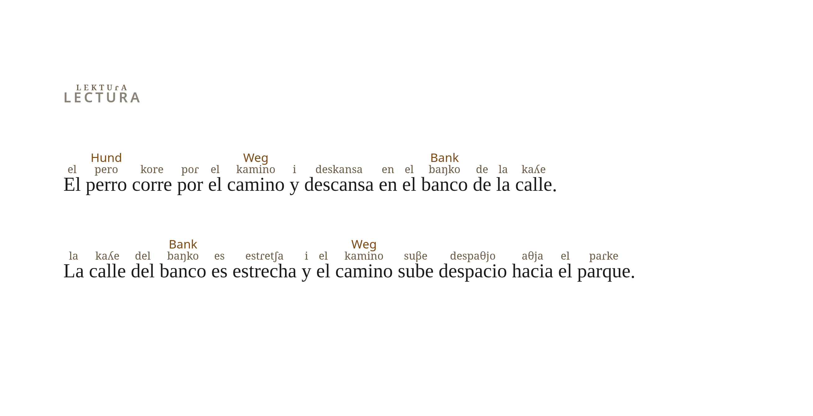
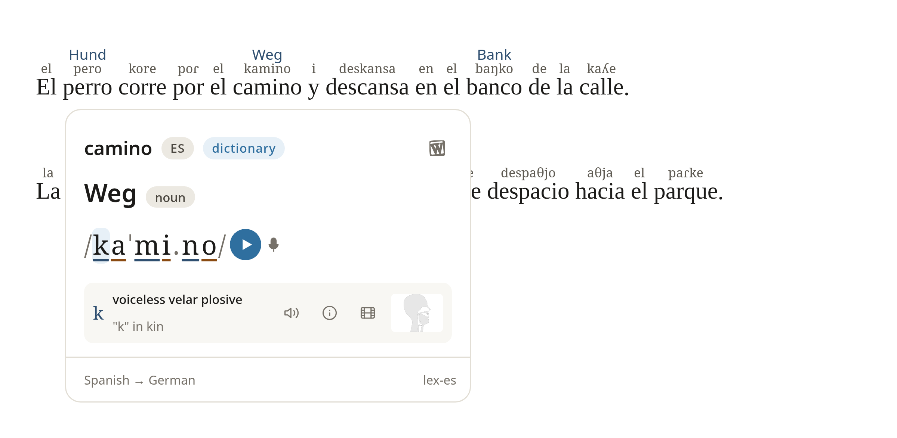
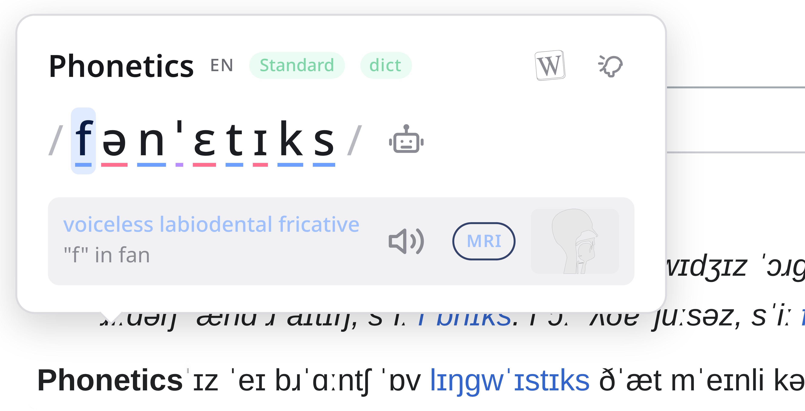

# phonetix

A browser extension that writes the IPA pronunciation above the words on a page,
so you can read a language you don't yet know how to say. It runs on Chrome and
Firefox from one codebase (WXT + Svelte 5).



## What it does

You pick one of two modes: the page shows IPA and a hover brings the original word
back, or the page stays as it is and a hover brings the IPA up.

Hovering a word opens a tooltip. It shows the transcription, where it came from
(a dictionary or the synthesizer), and a link to the word on Wiktionary. The IPA
in the tooltip is interactive: each symbol is coloured by kind, and hovering one
tells you what it is. From there you can read the Wikipedia article on that sound,
see a cross-section of the mouth making it, open the MRI and ultrasound film of it
on [Seeing Speech](https://www.seeingspeech.ac.uk/), and hear the sound, the word,
or a recording of a single symbol.

English has American, British, Australian, Scottish and other accents; Portuguese,
Catalan, Chinese, Persian, German, Spanish and more have their own. The tooltip
says which one you're looking at. A page written in more than one language (an
English video title on a German page) is read a block at a time, so each part is
transcribed as its own language. The tooltip and popup follow your system's light
or dark setting.

<p align="center">
   
</p>

## How a word is resolved

Every word runs through a cascade in `background.ts` (`phonemize`). The first tier
that has an answer wins, and that one answer drives the span on the page, the
tooltip, and the audio, so the three never disagree.

1. The dictionary for the block's language. These are offline IPA dictionaries
   built from Wiktionary (the kaikki dump, plus per-language Wiktionary data), one
   per language.
2. A cross-language lookup for what the block's dictionary missed. A loanword or a
   proper noun (Renault, Mount Everest) is checked against English before falling
   through, so it isn't mangled by the wrong language's rules.
3. espeak-ng, a grapheme-to-phoneme synthesizer compiled to WASM, as the last
   resort. It's skipped for Arabic, Hebrew and Han, where it just spells out the
   names of the letters; those words are left as they are on the page.

Around the cascade:

Homographs (*read*, *live*, *record*) are disambiguated from the surrounding words
by context classifiers (`src/lib/homograph.ts`).

Accents come from two places (`src/lib/accents.ts`). Where Wiktionary tags its
pronunciations by accent, `build-accents.mjs` pulls those into an overlay of the
words that accent says differently, and the background lays it over the base
dictionary: 27k American and 12k British English words, and overlays for
Portuguese, Catalan, Cantonese, Persian, Armenian, Welsh, Irish, Basque and
Vietnamese. Where it doesn't tag them, a few rules stand in (`src/lib/regions.ts`):
seseo and yeísmo for Latin-American Spanish, the ich-Laut merger and a trilled r
for Swiss German, rhoticity for American words the overlay never reached. The rules
run over the base dictionary and over espeak's output, so they cover words no
dictionary has. A dialect (Swabian, Saxon, Swiss German proper) is a different
matter: it has its own words and grammar, so it belongs in its own dictionary, and
none is shipped as an accent.

Words are split with `Intl.Segmenter` (`src/lib/segment.ts`), which handles Latin,
Cyrillic, Greek, Arabic, CJK, Thai and the rest, not only Latin. The language of
each block is decided by `eld` together with the page's own `lang` attribute.
Navigation, footers, buttons and ARIA landmarks are skipped by `CHROME_SELECTOR`;
the article itself is kept.

## Cross-browser espeak

espeak-ng needs a DOM and an AudioContext. Chrome's MV3 background is a service
worker with neither, so espeak runs in an offscreen document there. Firefox's
background has a DOM, so it runs the same engine directly (`src/lib/espeak-engine.ts`);
the offscreen permission is added only on Chrome (`wxt.config.ts`). Either way the
engine returns WAV bytes, which the content script plays through the Web Audio API.
Playing decoded bytes rather than pointing an `<audio>` element at a URL is what
keeps a page's `media-src` CSP from silently blocking the sound.

## Layout

```
src/entrypoints/  background.ts · content.ts · offscreen/ · popup/
src/lib/          types.ts (Languages, ResolvedIpa) · homograph.ts · regions.ts
                  accents.ts · segment.ts · espeak-engine.ts · messaging.ts · cache.ts
public/           dictionaries/*.json.gz · homographs/*.json.gz · espeak/
scripts/          build-dictionaries.mjs · build-accents.mjs · link-*.mjs · proofread/
```

## Develop

```sh
pnpm install
pnpm fetch:dict       # once: download the prebuilt IPA dictionaries
pnpm dev              # Chrome
pnpm dev:firefox      # Firefox
pnpm build            # + build:firefox
pnpm zip:firefox      # distributable; sign unlisted with web-ext to install
pnpm check            # svelte-check
pnpm build:dict       # rebuild the dictionaries from the ~2.3GB kaikki dump
```

The dictionaries are ~30 MB of binary data and aren't committed. `fetch:dict` pulls
the prebuilt set from a release asset; `build:dict` regenerates it from the kaikki
dump. Without them the extension falls back to espeak for every word.

## Testing

```sh
pnpm test              # unit: segmenter, script gating, homographs, language, accent rules, symbols
pnpm test:integration  # controlled fixtures driven through headless Chrome (CDP)
pnpm test:hover        # the hovered word must not move, measured in rendered pixels
pnpm test:popup        # every popup control shows its own label, nothing clipped
pnpm test:voices       # every espeak voice speaks, and every accent changes real words
pnpm test:names        # every IPA symbol name matches the IPA's own descriptor (ipapy)
pnpm test:firefox      # the same behaviour on real Firefox, including switching accents
pnpm test:e2e          # a handful of real sites, invariants only
```

CI runs all of this on every push, Chrome and Firefox in parallel. A few of the
tests are here because what they check went out broken once. `test:hover` measures
the rendered pixels because the word kept moving on hover while three checks of its
box passed. `test:names` checks against a database because a symbol name written
from memory was wrong and read as if it weren't. `test:voices` reads each voice
twice because espeak, asked for a voice it doesn't have, keeps the last one and
says nothing.

The unit tests (`scripts/test-*.ts`, run with node `--experimental-strip-types`)
are pure logic. The behavioural ones (`scripts/proofread/`) need a build present
and drive the extension over CDP through a `--remote-debugging-pipe`, because a
debug port gets killed by the sandbox on some machines. Among other things they
assert a health probe: that language detection, the dictionaries and espeak are all
actually working, not quietly degraded. The Firefox suite drives a real Firefox
over Marionette, since its espeak path differs from Chrome's.
